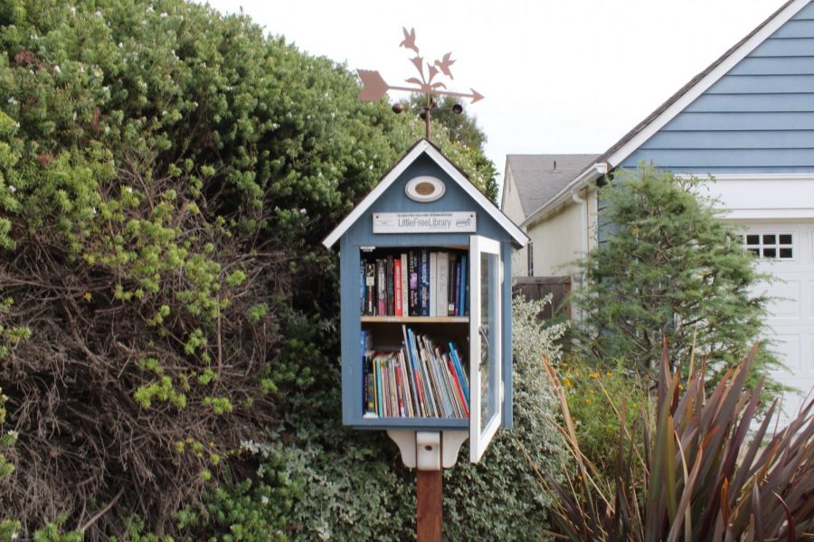

# Project Name
Biblio

[*how?*](https://help.github.com/articles/about-readmes/#relative-links-and-image-paths-in-readme-files)

TODO: a community book exchange that's main goals are to help users save money, encourage more reading, reduce overconsumption, and build community

## Architecture

TODO: 

Vite
React, React Router
ESLint
Autoprefixer:
Sass

## Setup

TODO: how to get the project dev environment up and running, npm install etc

git clone https://github.com/dartmouth-cs52-24s/project-client-biblio.git
cd frontend-starterpack-jeanmarcosp
npm install

## Deployment

TODO: how to deploy the project

npm run test - start the server
npm run dev - build the server
npm run build

## Authors

TODO: 
Jeanmarcos Perez
Christian King Nyamekye
Maya Folasade Cole
Paige Marie Nakai
Abdibaset Ahmed Bare

## Acknowledgments
