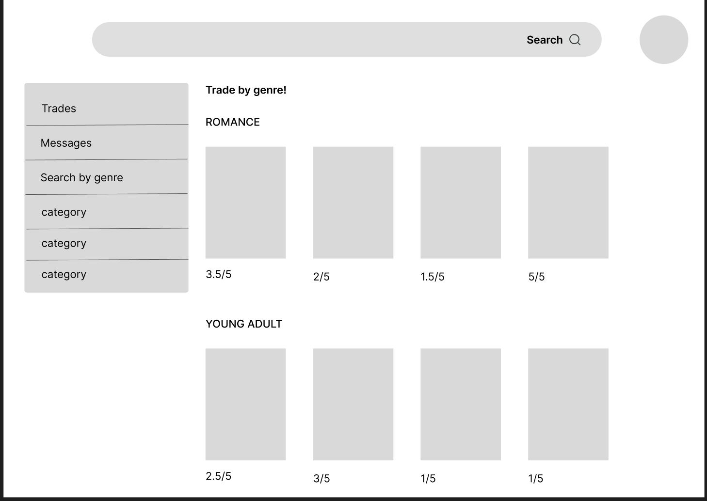

# Project Name

Biblio

[_how?_](https://help.github.com/articles/about-readmes/#relative-links-and-image-paths-in-readme-files)

TODO: a community book exchange that's main goals are to help users save money, encourage more reading, reduce overconsumption, and build community

<<<<<<< HEAD
[Figma Prototype](https://www.figma.com/design/SXQm9nYUGNsUjumvxsll7X/biblio-design-file?t=9M1UaofOWGRBIG3Y-0)

=======
>>>>>>> 050f3fb (add more info on the client side repo)

## Architecture

Done:

<ul>
    <li>Vite</li>
    <li>ESLint Autoprefixer</li>
</li>

TODO: In progress

<ul>
    <li>React</li>
    <li>React and React Router </li>
    <li>Sass</li>
</ul>
## Setup

TODO: how to get the project dev environment up and running, npm install etc

Local development workflow:
<code>git clone https://github.com/dartmouth-cs52-24s/project-client-biblio.git</code>
<code>cd frontend-starterpack-jeanmarcosp</code> 
<code>npm install</code> and other module necessary 
Hookup store to backend to send requests and receive responses. 

## Deployment

TODO: how to deploy the project

Local testing:
<code>npm run test</code> - start the server api
<code>npm run dev</code> - run the frontend client hooked up to the api
<code>npm run build</code>

Deploying:
Set up a backend database to serve as our environment
Deploy as a webservice on the using the backend environment

## Authors

<<<<<<< HEAD
TODO: 
Jeanmarcos Perez, 
Christian King Nyamekye, 
Maya Folasade Cole, 
Paige Nakai, 
Abdibaset Ahmed Bare

=======
<ul>
    <li>Jeanmarcos Perez</li>
    <li>Christian King Nyamekye</li>
    <li>Maya Folasade Cole</li>
    <li>Paige Marie Nakai</li>
    <li>Abdibaset Ahmed Bare</li>
</ul>
>>>>>>> 050f3fb (add more info on the client side repo)
## Acknowledgments
